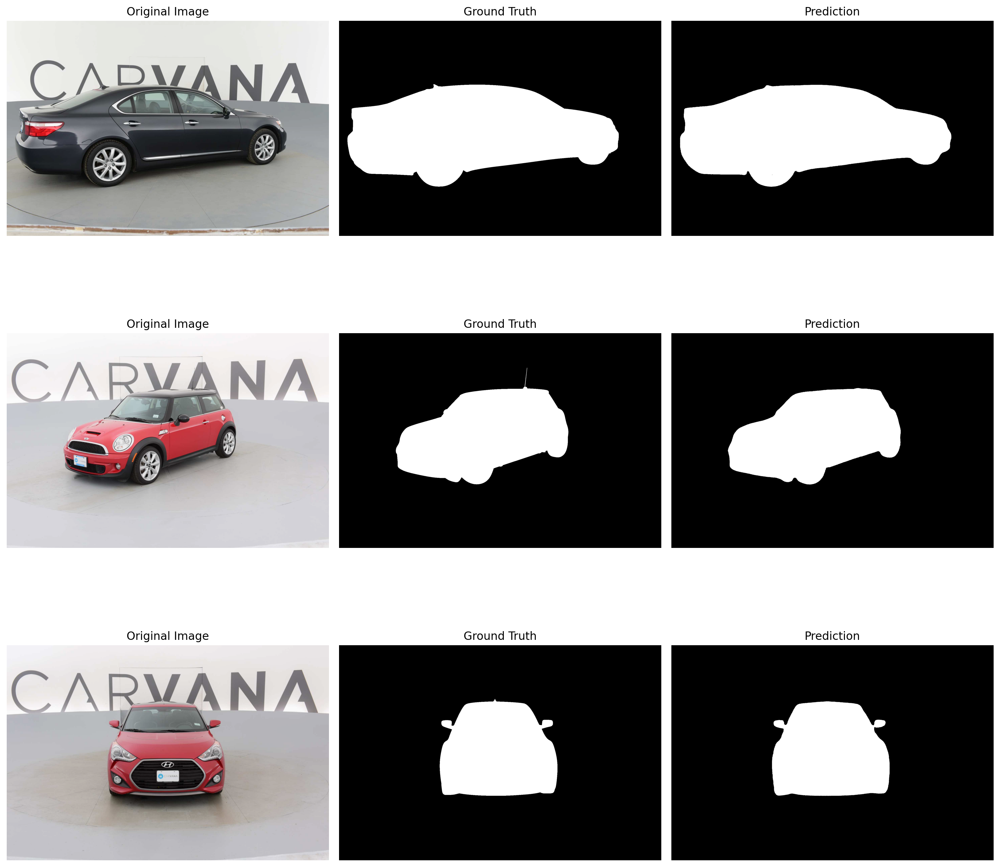
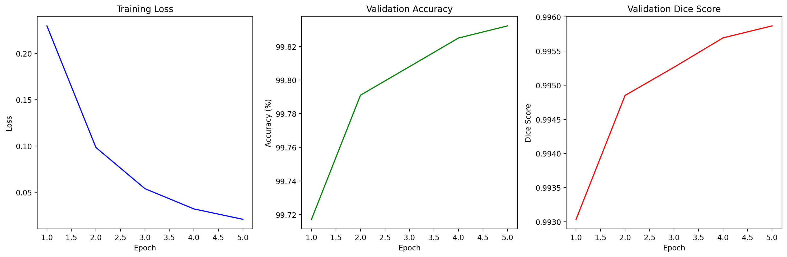

# carvana-seg-resnet18
Exploration project that performs Image Segmentation on the Carvana Dataset using Transfer Learning on a pre-trained ResNet-18

## Instructions to set up the project locally
```bash
python3 -m venv env
```
Activating the environment on Windows:
```bash
env\Scripts\activate
```
Activating the environment on MacOS/Linux:
```bash
source env/bin/activate
```
Installing dependencies:
```bash
pip3 install -r requirements.txt
```

The dataset can be downloaded from [here](https://www.kaggle.com/competitions/carvana-image-masking-challenge/data)
I've moved random 48 images from train to validation.

## Model Architecture

- **Encoder (ResNet18)**:
  - Conv1: Initial convolution + batch norm + ReLU
  - MaxPool: Reduces spatial size
  - Layer1, Layer2, Layer3, Layer4: ResNet layers with increasing channels (64, 128, 256, 512)

- **Decoder**:
  - Decoder1: ConvTranspose2d (512 → 256) + BatchNorm + ReLU
  - Decoder2: ConvTranspose2d (256 → 128) + BatchNorm + ReLU
  - Decoder3: ConvTranspose2d (128 → 64) + BatchNorm + ReLU
  - Decoder4: ConvTranspose2d (64 → 32) + BatchNorm + ReLU
  - Decoder5: ConvTranspose2d (32 → num_classes)

The output layer resizes to match the input image dimensions if necessary.

## Results

